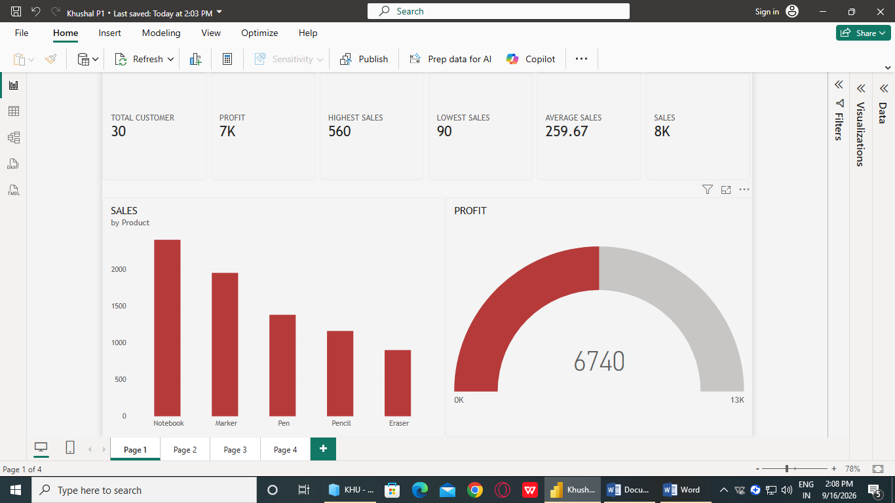
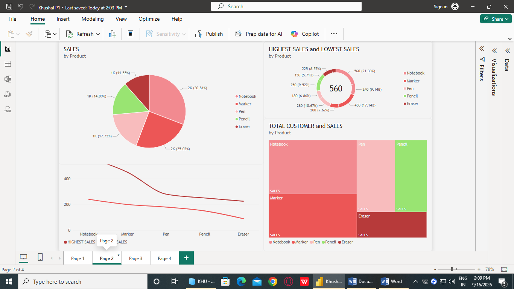
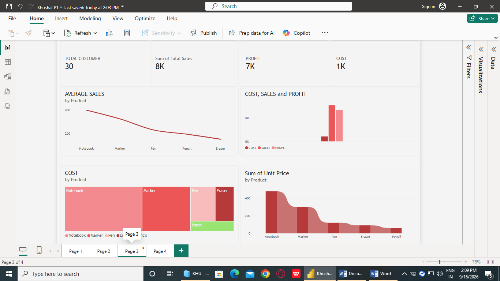
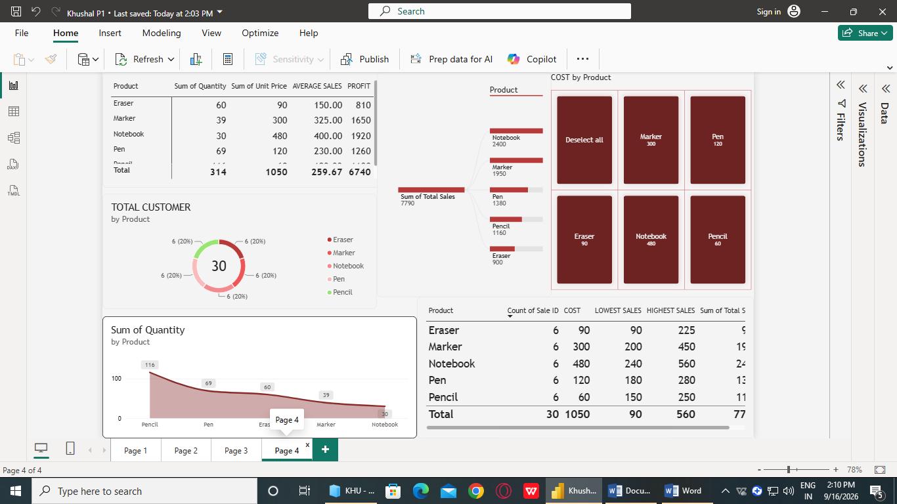
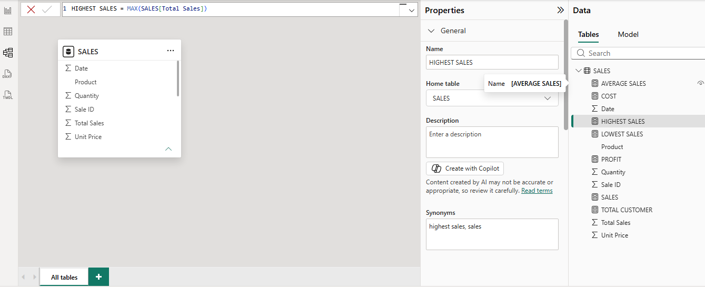
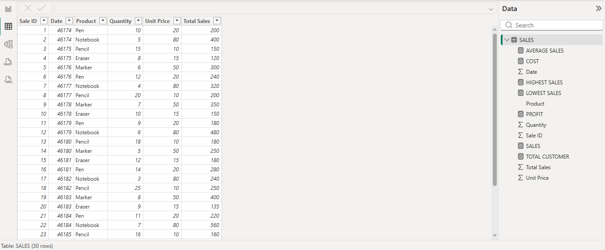

# 📊 Sales Performance Dashboard | Power BI Project

Welcome to my Power BI Sales Dashboard project! This repository showcases an interactive, multi-page business intelligence report designed to analyze sales, costs, profits, and customer trends across various products.

**Created by:** [@Khushaaaaal](https://github.com/Khushaaaaal)

## 🚀 Project Overview
This dashboard transforms raw sales data into actionable insights. It tracks key performance indicators (KPIs) such as Total Customers, Profit, Highest/Lowest Sales, and Average Sales. It also features dynamic visualizations to break down performance by product (Notebooks, Markers, Pens, Pencils, Erasers).

## 📸 Dashboard Screenshots

### Page 1: Executive Summary & Profit Overview
*High-level KPIs, overall Sales by Product (Bar Chart), and Profit breakdown (Gauge Chart).*

### Page 2: Sales Distribution & Customer Analysis
*Pie charts, Donut charts, and Treemaps visualizing sales distribution and customer counts.*

### Page 3: Cost, Profit & Average Metrics
*Detailed line charts and stacked bar charts analyzing Average Sales, Cost, Sales, and Profit margins.*

### Page 4: Deep Dive Matrix & Slicers
*Detailed tabular view with conditional formatting, interactive slicers, and a summary matrix.*

## 🛠️ Technical Details

### Data Model & DAX
I implemented custom DAX (Data Analysis Expressions) measures to calculate critical business metrics dynamically.

**Key DAX Measures Used:**
*   `HIGHEST SALES = MAX(SALES[Total Sales])`
*   `LOWEST SALES = MIN(SALES[Total Sales])`
*   `AVERAGE SALES = AVERAGE(SALES[Total Sales])`
*   `TOTAL CUSTOMER = DISTINCTCOUNT(SALES[Sale ID])`
*   `PROFIT = SUM(SALES[Total Sales]) - SUM(SALES[Cost])`

### Dataset Sample
The underlying dataset contains transactional records including Date, Product, Quantity, Unit Price, Total Sales, and Cost.

## 💡 Key Insights Derived
*   **Notebooks** are the highest revenue-generating product.
*   Total Profit reached **7K** against a total cost of **1K**.
*   The average sale value per transaction is **259.67**.
*   Customer distribution is evenly spread at **30 total customers** across the analyzed period.

## ⚙️ How to Use
1. Clone this repository.
2. Open the `.pbix` file using **Power BI Desktop**.
3. Interact with the slicers and filters to explore the data dynamically.

---
*If you like this project, feel free to ⭐ this repository!*
